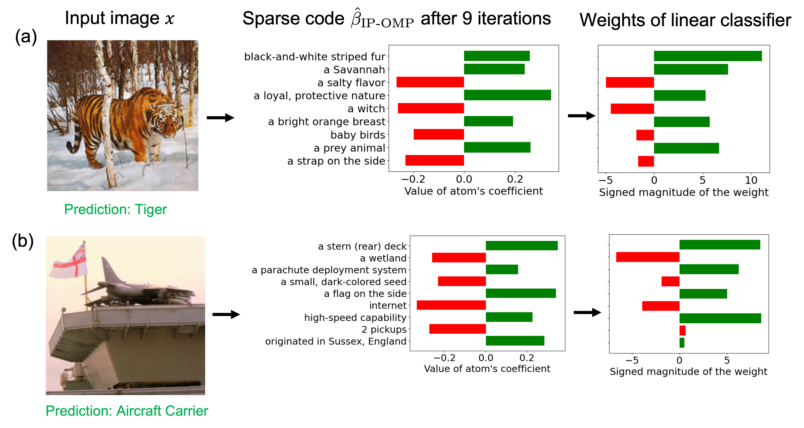

# Information Maximization Perspective of Orthogonal Matching Pursuit with Applications to Explainable AI
**Aditya Chattopadhyay¹, Ryan Pilgrim¹, and René Vidal²** <br>

**¹Johns Hopkins University, USA, `{achatto1,rpilgri1} <at> jhu.edu`**

**²University of Pennsylvania, USA, `vidalr <at> upenn.edu`**

This repository contains code to accompany [*Information Maximization Perspective of Orthogonal Matching Pursuit with Applications to Explainable AI (NeurIPS 2023)*](https://openreview.net/forum?id=CAF4CnUblx).

## Overview
<p align="center">

</p>

Information Pursuit (IP) is a classical active testing algorithm for predicting an output by sequentially and greedily querying the input in order of information gain. However, IP is computationally intensive since it involves estimating mutual information in high-dimensional spaces. This paper explores Orthogonal Matching Pursuit (OMP) as an alternative to IP for greedily selecting the queries. OMP is a classical signal processing algorithm for sequentially encoding a signal in terms of dictionary atoms chosen in order of correlation gain. In each iteration, OMP selects the atom that is most correlated with the signal residual (the signal minus its reconstruction thus far). Our first contribution is to establish a fundamental connection between IP and OMP, where we prove that IP with random projections of dictionary atoms as queries "almost" reduces to OMP, with the difference being that IP selects atoms in order of normalized correlation gain. We call this version IP-OMP and present simulations indicating that this difference does not have any appreciable effect on the sparse code recovery rate of IP-OMP compared to that of OMP for random Gaussian dictionaries. Inspired by this connection, our second contribution is to explore the utility of IP-OMP for generating explainable predictions, an area in which IP has recently gained traction. More specifically, we propose a simple explainable AI algorithm which encodes an image as a sparse combination of semantically meaningful dictionary atoms that are defined as text embeddings of interpretable concepts. The final prediction is made using the weights of this sparse combination, which serve as an explanation. Empirically, our proposed algorithm is not only competitive with existing explainability methods but also computationally less expensive.

## Setup
If on Mac, type
```
conda env create -f environment_mac.yml
```
If on Linux, type
```
conda env create -f environment_mac.yml
```
Windows is currently not supported.

## Sparse Recovery Experiments
To execute all of the sparse recovery experiments in one go, run
```
./script/sparse_recovery_experiments.sh
```
from the repository root directory. To plot all of the results from running the above script, run
```
./script/sparse_recovery_plots.sh
```

Due to the way things are saved, these scripts will consume a lot of disk space (≈900 GB). We are working on lightening this disk usage.

### Finer-Grained Scripts
To run a smaller subset of experiments, you can use the `ip_omp/simulations.py` CLI:
```
$ python -m ip_omp.simulations --help

 Usage: python -m ip_omp.simulations [OPTIONS] RESULTS_DIR

╭─ Arguments ──────────────────────────────────────────────────────────────────╮
│ *    results_dir      PATH  Where to save the results. [default: None]       │
│                             [required]                                       │
╰──────────────────────────────────────────────────────────────────────────────╯
╭─ Options ────────────────────────────────────────────────────────────────────╮
│ --problem-size                          [small|large]      The size of the   │
│                                                            problem n=256     │
│                                                            (small) or n=1024 │
│                                                            (large).          │
│                                                            [default: small]  │
│ --coeff-distribut…                      [sparse_gaussian|  The distribution  │
│                                         sparse_const]      of the            │
│                                                            coefficients of   │
│                                                            the sparse code.  │
│                                                            [default:         │
│                                                            sparse_gaussian]  │
│ --noise-setting                         [noiseless|noisy]  The noise setting │
│                                                            of the            │
│                                                            experiment.       │
│                                                            [default:         │
│                                                            noiseless]        │
│ --overwrite           --no-overwrite                       Whether to        │
│                                                            overwrite         │
│                                                            existing results. │
│                                                            [default:         │
│                                                            no-overwrite]     │
│ --jobs                                  INTEGER RANGE      Maximum number of │
│                                         [x>=1]             subprocesses to   │
│                                                            run.              │
│                                                            [default: 1]      │
│ --device                                [cuda|cpu]         Device to use     │
│                                                            (CPU/GPU).        │
│                                                            [default: cpu]    │
│ --memory-usage                          FLOAT RANGE        Memory usage      │
│                                         [0.0<=x<=1.0]      below which a GPU │
│                                                            will be           │
│                                                            considered free   │
│                                                            when launching    │
│                                                            new subprocesses. │
│                                                            [default: 0.75]   │
│ --utilization                           FLOAT RANGE        Utilization below │
│                                         [0.0<=x<=1.0]      which a GPU will  │
│                                                            be considered     │
│                                                            free when         │
│                                                            launching new     │
│                                                            subprocesses.     │
│                                                            [default: 0.75]   │
│ --order-by                              [utilization|memo  How to sort       │
│                                         ry_usage]          available GPUs    │
│                                                            when launching    │
│                                                            subprocesses.     │
│                                                            [default:         │
│                                                            utilization]      │
│ --help                                                     Show this message │
│                                                            and exit.         │
╰──────────────────────────────────────────────────────────────────────────────╯
```

For finer-grained control over plotting, you can also use the `ip_omp/figures.py` CLI. The `plot-noiseless` command is meant for plotting the noiseless experiment results:
```
$ python -m ip_omp.figures plot-noiseless --help

 Usage: python -m ip_omp.figures plot-noiseless [OPTIONS] SMALL_RESULT_PATH
                                                LARGE_RESULT_PATH

 Plot the results of the noiseless sparse recovery experiments.

╭─ Arguments ──────────────────────────────────────────────────────────────────╮
│ *    small_result_path      PATH  Path to the small (n=256) results file.    │
│                                   [default: None]                            │
│                                   [required]                                 │
│ *    large_result_path      PATH  Path to the large (n=1024) results file.   │
│                                   [default: None]                            │
│                                   [required]                                 │
╰──────────────────────────────────────────────────────────────────────────────╯
╭─ Options ────────────────────────────────────────────────────────────────────╮
│ --coeff-distribut…                     [sparse_gaussian|  The distribution   │
│                                        sparse_const]      of the             │
│                                                           coefficients of    │
│                                                           the sparse code.   │
│                                                           [default:          │
│                                                           sparse_gaussian]   │
│ --save-dir                             PATH               Where to save      │
│                                                           resulting plots.   │
│                                                           [default: .]       │
│ --save-file-format                     [eps|png]          Format of the plot │
│                                                           file.              │
│                                                           [default: png]     │
│ --together            --no-together                       Whether to plot    │
│                                                           small (n=256) and  │
│                                                           large (n=1024)     │
│                                                           results in the     │
│                                                           same figure.       │
│                                                           [default:          │
│                                                           no-together]       │
│ --help                                                    Show this message  │
│                                                           and exit.          │
╰──────────────────────────────────────────────────────────────────────────────╯
```
The `plot-noisy` command is meant for plotting the noisy experiment results:
```
$ python -m ip_omp.figures plot-noisy --help

 Usage: python -m ip_omp.figures plot-noisy [OPTIONS] SMALL_RESULT_PATH
                                            LARGE_RESULT_PATH

 Plot the results of the noisy sparse recovery experiments.

╭─ Arguments ──────────────────────────────────────────────────────────────────╮
│ *    small_result_path      PATH  Path to the small (n=256) results file.    │
│                                   [default: None]                            │
│                                   [required]                                 │
│ *    large_result_path      PATH  Path to the large (n=1024) results file.   │
│                                   [default: None]                            │
│                                   [required]                                 │
╰──────────────────────────────────────────────────────────────────────────────╯
╭─ Options ────────────────────────────────────────────────────────────────────╮
│ --save-dir                PATH       Where to save resulting plots.          │
│                                      [default: .]                            │
│ --save-file-format        [eps|png]  Format of the plot file. [default: png] │
│ --help                               Show this message and exit.             │
╰──────────────────────────────────────────────────────────────────────────────╯
```

## CLIP-IP-OMP Experiments
Coming soon.

## License
This repository is MIT-licensed. See [LICENSE](./LICENSE) for details.

## Cite
```
@inproceedings{
chattopadhyay2023information,
title={Information Maximization Perspective of Orthogonal Matching Pursuit with Applications to Explainable {AI}},
author={Aditya Chattopadhyay and Ryan Pilgrim and Ren\'{e} Vidal},
booktitle={Thirty-seventh Conference on Neural Information Processing Systems},
year={2023},
url={https://openreview.net/forum?id=CAF4CnUblx}
}
```
